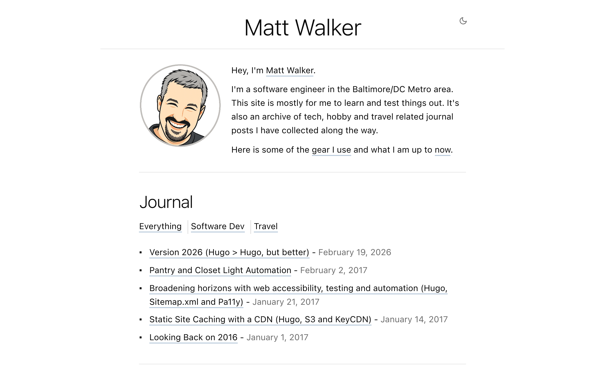

# MrMatt.io

  

Personal website of **Matt Walker** — software engineer, data & AI practitioner, and serial hobbyist in the Baltimore/DC Metro area. This site is a static, zero-framework playground for publishing writing, sharing photography, and experimenting with modern web tech.

**[mrmatt.io](https://mrmatt.io)**

## Built With

**Static Site** — [Hugo](https://gohugo.io/) extended with [PaperMod](https://github.com/adityatelange/hugo-PaperMod) theme. No npm, no build tools, no JS frameworks — just Hugo's built-in asset pipeline and custom CSS.

**Spec-Driven Workflow** — Every feature starts with a numbered spec in `.specs/`, gets built in an isolated git worktree, and ships via automated PR with auto-merge — powered by [Claude Code](https://docs.anthropic.com/en/docs/claude-code).

**Serverless Backend** — Three [Cloudflare Pages Functions](https://developers.cloudflare.com/pages/functions/) handle Claude Vision proxying, GitHub OAuth token exchange, and client configuration — all server-side with CORS locked down.

**CI/CD** — [GitHub Actions](https://github.com/features/actions) builds Hugo, compiles Cloudflare Functions, and deploys on every push to `main`. Concurrency controls cancel in-progress deploys when a new push arrives.

**Automated Publishing** — Photos go from camera roll to live on the site with zero terminal interaction. The PWA creates a feature branch, commits the image and Hugo content file, opens a PR with auto-merge, and GitHub Actions deploys it.

**Photo Upload PWA** — A vanilla JavaScript progressive web app at [`/upload`](https://mrmatt.io/upload/) that works as an Android share target. Snap a photo, share it to the site, and it's published — with offline queuing, EXIF date parsing, and client-side image processing. No libraries, no dependencies.

**AI-Powered Descriptions** — Uploaded photos are automatically described by [Claude](https://www.anthropic.com/) Haiku vision model — generating titles, alt text, and personalized descriptions. Review the AI output, tweak it, regenerate, and publish.

See the full stack breakdown at **[mrmatt.io/stack](https://mrmatt.io/stack)**

## License

Content is licensed under [Creative Commons BY 4.0](https://creativecommons.org/licenses/by/4.0/).

---

[Development setup](docs/dev-setup.md)
