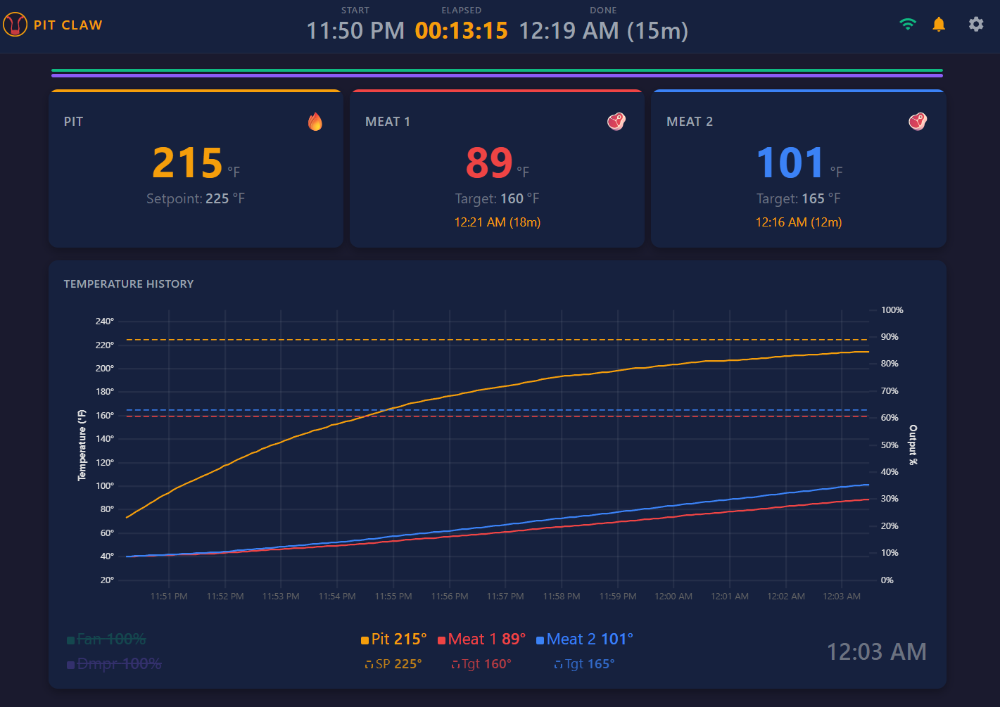

> This is the first note in what may become a larger PitClaw build log.

This post is a little early because [PitClaw](https://github.com/MrMatt57/pitclaw) is not done yet.

I have a working simulator. I have a real web UI. I have predictive graphs, PID control logic, OTA updates, a touchscreen dashboard, and a mostly soldered pile of parts on my desk. What I do **not** have, at least as I write this, is a finished controller sitting on a smoker holding a perfect brisket temp for twelve hours.

So this is not a victory lap. It is more like building in public... with a decent chance of scraping some plastic, reprinting parts, misreading a schematic, and learning something useful anyway.

*The software side is very real already. The hardware side is still earning its keep.*

### The backstory

I have been using a [HeaterMeter](https://github.com/CapnBry/HeaterMeter/wiki/An-Introduction-to-LinkMeter---HeaterMeter) on my ugly drum smoker for years, and I mean that as a compliment. It is one of those projects that sits right at the intersection of barbecue, electronics, software, and time behind a soldering iron... which is pretty much my kind of thing. I still use one today, and it has served me really well.

The temperature control is solid. The graphs are useful. It does the thing I care about most, which is giving me enough information to understand the cook instead of just blinking "225" and hoping for the best.

And honestly, that experience is a big part of why PitClaw exists. Using HeaterMeter for years taught me what I actually want out of a smoker controller.

I am not trying to replace it out of spite. I am just ready for a refresh. I want the same spirit, the same fun, and the same hands-on hobby energy... just in a package that feels more modern, more approachable, and more like something I would hand to another barbecue nerd without needing a twenty-minute preamble.

Before I signed myself up for another hardware project, I did the obvious thing and looked at what I could just buy.

I bought the [ThermoWorks Signals](https://www.thermoworks.com/products/signals) and Billows combo because the hardware is good and ThermoWorks probes are, in my opinion, the best. I figured maybe the modern version of what I wanted was already sitting on the shelf and I could skip the whole "build my own controller" detour.

That is not how it went.

The Billows hardware was nice, but I found myself missing the software from the open-source build I was already using. The big one was PID and the ability to actually hold temperature well. If the thing cannot hold temperature, then it is not doing the job. I also wanted predictive info. I wanted to see where the cook was going. I wanted something smarter than "fan on, fan off." More than anything, I wanted a controller that made barbecue feel a little more fun and a little less like I was settling.

That was the moment I realized I was probably going to end up building my own.

### Why now

The funny part is I have wanted to build something like this for a long time. The idea was never the problem. Time was the problem.

A few years ago this would have stayed in the category of "projects I would love to build someday." Embedded firmware, web UI, simulation, hardware, enclosure design, documentation... that is a lot of surface area for one hobby project.

What changed was [spec-driven development](/posts/building-mrmatt-io-specs/) and agent-assisted engineering. Once I could write down what I wanted clearly enough, then iterate with an agent against that spec, this stopped feeling like a someday project and started feeling like something I could actually pull off myself.

That changed the order of operations too. I did not have to start with a bench full of parts. I could start with behavior. I could have it build a simulator, then a hardware emulator, then have the emulator emit the API the real device would use. That let me work on the real software early, before the physical build was ready.

With that in mind, PitClaw is my attempt to build the smoker controller I wish existed:

- Open source
- Modern and easy to connect to
- Good enough hardware to leave outside on a real cook
- Smart enough software to show prediction, not just current temperature
- Friendly to low-voltage and battery-powered setups for camping and travel cooks
- Simple enough that someone else could actually build it without making it their whole personality for a month

That last one matters a lot to me. I like the hobby part. I like the soldering iron, the tuning, the weird little hardware decisions, and the barbecue excuse to care about all of it. The goal here is not to reject that fun. It is to take it forward and make something more approachable.

### The software sprint

Once I had a clear enough spec, the software moved waaay faster than I expected. First I had it build a simulator. Then a hardware emulator. Then I had the emulator emit the same API the real device would use. That let me do the full web layer early, while the physical hardware was still imaginary. From there it was surprisingly straightforward to build out PID control, prediction, session logging, OTA updates, and the touchscreen flow.

The repo history tells that story pretty clearly.

<canvas id="pitclaw-velocity-chart"></canvas>

From February 11 to February 18, the project went from scaffold to simulator, touchscreen UI, prediction, OTA, release workflow, assembly docs, and schematic cleanup. The software sprint was real. The chart is counting non-merge commits by day, grouped loosely into software, project polish, and hardware work.

### Then the project touched the real world

This is where things got humbling.

Software is happy to pretend. Hardware is not.

In the simulator, the touchscreen always fits. The connector is always the connector you imagined. The enclosure hole is exactly where you drew it. The cable is the one the model said to buy. None of that survives first contact with a bench full of parts.

I have been through multiple 3D print iterations already just trying to get fit, clearances, and panel holes right. I still need to take a picture of the pile of failed prints because it deserves to be documented. There is a whole little plastic graveyard forming over here.

The wiring side slowed me down too. The first pass at the plan was honestly pretty good, but I hit some friction reading the schematic and translating that into actual parts on the bench. Then there was the connector issue. Claude was very confident that the display cable I needed was a JST. It was not. The WT32-SC01 Plus needed a tiny 1.25mm PicoBlade-style cable instead. I lost time there until I switched tools, got the right part identified, and ordered what I actually needed.

That is not a complaint, by the way. That is the story.

The software phase made me feel like embedded projects had suddenly gotten cheap. The hardware phase reminded me that atoms still have opinions.

### Where it stands

The part I find most interesting right now is how uneven the project has been in a good way. The software side is much further along than I expected. The simulator is real. The web UI is real. The prediction and control logic are real. I can see the shape of the finished thing very clearly now.

The hardware side has been slower, which is not shocking... it is just the nature of physical projects. Connectors matter. Schematic details matter. Printed parts need another iteration. Bench time matters. The remaining work is not mysterious anymore, though. It is concrete.

The immediate target is the [Weber Smokey Mountain 18](https://www.weber.com/US/en/grills/charcoal-grills/smokey-mountain/smokey-mountain-cooker-smoker-18/721001.html). I am in the middle of switching over from my UDS, and the WSM feels like the sweet spot: common enough to matter, affordable enough to be realistic, and serious enough that good control actually helps.

This is a side project, and realistically it moves forward on weekends and whenever I can make the time. That is fine. The point of writing about it now is just to document what I have built so far, what went surprisingly fast, and where the real friction has been.

### The next stretch

The next stretch is getting the physical hardware fully buttoned up and then tuning it on the Weber Smokey Mountain 18.

That is the fun part now. The software gave me a head start. The challenge is making the physical build catch up... more wiring, more print iterations, more bench work, then real cooks.

More to follow...

